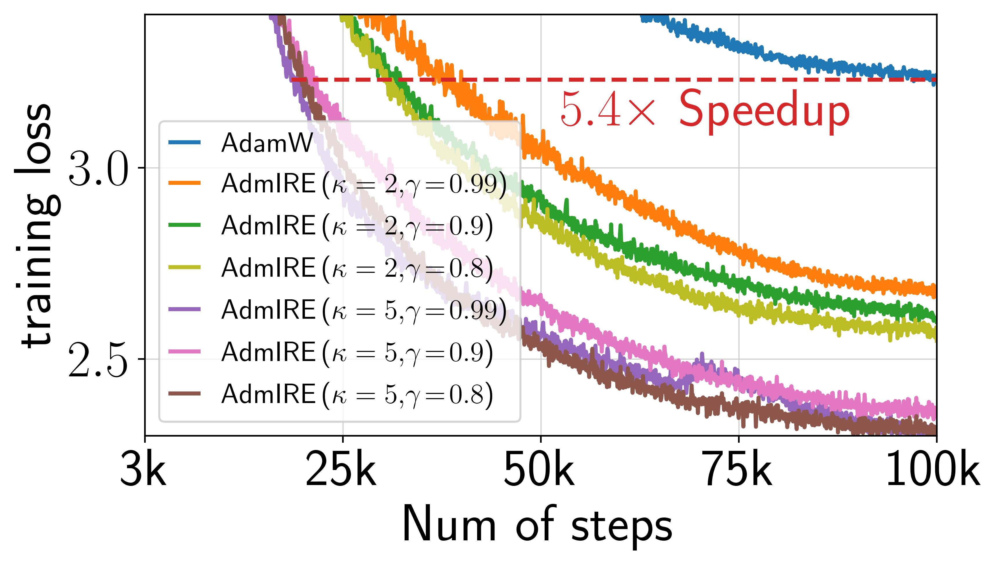

# IRE: A Deep Learning Theory-inspired Advanced Algorithm Framework


This repository contains the official code of Implicit Regularization Enhancement (IRE) algorithm framework, introduced in the paper [Improving Generalization and Convergence by Enhancing Implicit Regularization (NeurIPS 2024)](https://arxiv.org/abs/2405.20763). Please cite the paper and star this repo if you find IRE useful. Thanks!

```
@article{wang2024improving,
  title={Improving Generalization and Convergence by Enhancing Implicit Regularization},
  author={Wang, Mingze and Wang, Jinbo and He, Haotian and Wang, Zilin and Huang, Guanhua and Xiong, Feiyu and Li, Zhiyu and E, Weinan and Wu, Lei},
  journal={Advances in Neural Information Processing Systems},
  year={2024}
}
```


## Highlights

**Generality**: 
- **Broad optimizer compatibility**: IRE can be practically incorporated with *generic base optimizers*, such as `SGDIRE` for SGD, `SAMIRE` for [SAM (sharpness-aware minimization)](https://github.com/davda54/sam?tab=readme-ov-file), and `AdmWIRE` for [Adam(W)](https://pytorch.org/docs/stable/generated/torch.optim.AdamW.html).
- **Wide applicability**: IRE is effective for both Large language model (LLM) pretraining and smaller over-paramterized networks, such as WideResNets.

**Experimental Performance**: IRE achieves better generalization and faster optimization across a variety of tasks.

- **Faster Optimization**: In LLM pretraining, IRE achieves a **2× speed-up** over AdamW for LLaMA models (from 60M to 229M parameters) on datasets including Wikitext-103, Minipile, and Openwebtext. 

- **Better Generalization**: For image classification, IRE consistently improves the generalization performance across a variety of benchmark datasets (CIFAR-10/100, ImageNet).

**Theoretical Foundations**: The design of IRE draws from deep learning theory, and yielding theoretical benefits.

- **Theory-Inspired Design**: IRE is designed to enhance the [*implicit reguralization*](https://arxiv.org/abs/2208.12591) (a critical topic in deep learning theory) of base optimizers;
- **Theoretical Advantages**: While SAM exhibits superior sharpness regularization compared to SGD, we theoretically demonstrates that IRE can further accelerate the convergence towards flatter minima than SAM substantially.

## Motivation and Algorithm
IRE is designed to enhance the implicit reguralization of base optimizers.


## Transformer on wikitext-2
<p align="center">

</p>

```
cd NLP/small-scale
run TF_ire.ipynb
```

## LLaMA on wikitext-103/minipile/openwebtext
<p align="center">


</p>

```
cd NLP/LLM
torchrun --standalone --nproc_per_node=2 train_adamire_wiki103_Llama.py --batch_size=40 --grad_micro_steps=3 --total_bs=240 --max_lr=6e-4 --rank=0.4 --prog=3
torchrun --standalone --nproc_per_node=2 train_adamire_pile_Llama.py --batch_size=15 --grad_micro_steps=10 --total_bs=300 --max_lr=6e-4 --rank=0.4 --prog=4.0
torchrun --standalone --nproc_per_node=2 train_adamire_web_Llama.py --batch_size=16 --grad_micro_steps=15 --total_bs=480 --max_lr=6e-4 --rank=0.4 --prog=4.0

```
## ViT/ResNet on ImageNet

<p align="center">


</p>

```
cd CV/imagenet
accelerate launch --config_file config_file_compile_nomix_multi.yaml --num_processes 4 main.py -a taViT-S/16 -b 1024 --optim AdamW --epochs 300 --warmup-epochs 30 --project_dir logs_ire --project_name vit_imagenet --enable-ire --ire-rank 0.2 --prog 2.0 --ire-epochs 100
```
## ResNet/ViT on CIFAR-10/100

<p align="center">


</p>

```
cd CV/cifar
python cifar_IRE_same.py --dataset=CIFAR10 --model=resnet56 --base_optimizer=SGD --method=SGD --batch_size=128 --lr=5 --momentum=0 --epochs=100 --IRE_start_epoch=60 --rank=0.01 --prog=0 --gpu=6 --random_seed=11
```

# Theoretical Advantages
While SAM exhibits superior sharpness regularization compared to SGD, we theoretically demonstrates that IRE can further accelerate the convergence towards flatter minima than SAM substantially.
<p align="center">

</p>